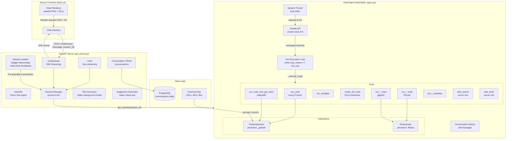
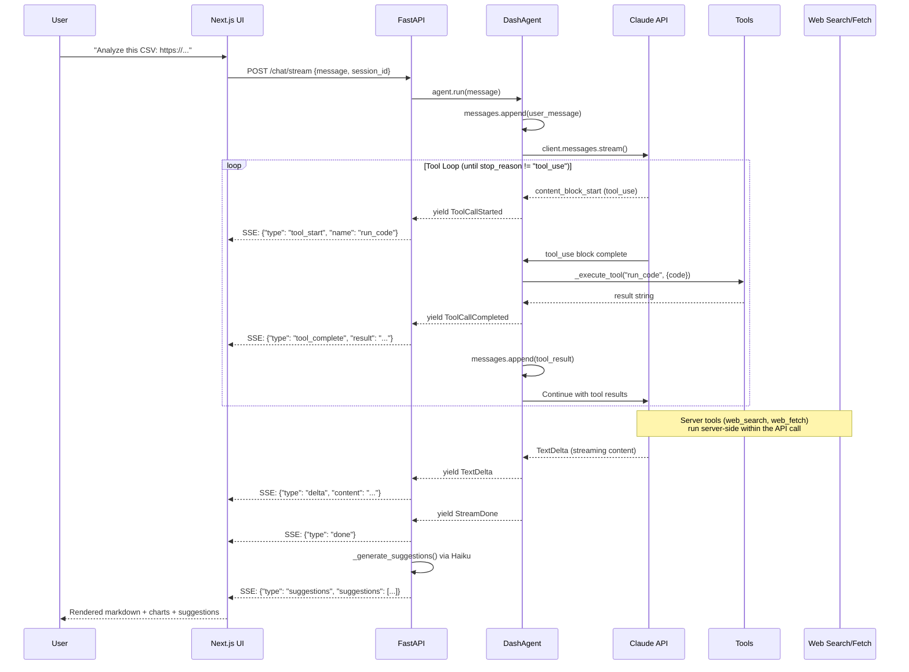

# CLAUDE.md

This file provides guidance to Claude Code (claude.ai/code) when working with code in this repository.

## Project Overview

Dash is a general-purpose data analysis agent that delivers **insights, not just results**. It works with any data source — URLs, CSVs, APIs, pasted data, or pre-loaded datasets from Kaggle, TidyTuesday, OWID, FRED, and the World Bank. Built with pure Anthropic SDK — no framework dependencies.

## System Architecture



## Data Flow (Streaming)



## Directory Structure

```
dash-repo/
├── api_server.py                 # FastAPI server — MAIN ENTRY POINT
│                                 # SSE streaming, conversations CRUD, session mgmt,
│                                 # dataset loaders (Kaggle, TidyTuesday, OWID, FRED, World Bank),
│                                 # chart fix vision sub-agent, Haiku titles & suggestions
├── Dockerfile                    # Container image (agnohq/python:3.12 base)
├── compose.yaml                  # Docker Compose — PostgreSQL (pgvector:18) + API
├── pyproject.toml                # Python project config (requires-python >=3.12)
├── requirements.txt              # Pinned dependencies (generated by uv)
├── CLAUDE.md                     # This file
├── charts/                       # Runtime directory for chart PNGs and interpreter temp files
├── dash/
│   ├── __init__.py               # Exports: DashAgent, create_agent
│   ├── __main__.py               # CLI: python -m dash
│   ├── dash_agent.py             # Core agent — DashAgent, CodeInterpreter, TOOLS, events, system prompt
│   ├── r_interpreter.py          # R code execution (RInterpreter class, R_TOOLS)
│   ├── paths.py                  # Path constants (KNOWLEDGE_DIR, CHARTS_DIR, etc.)
│   ├── context/                  # System prompt builders (semantic model + business rules)
│   │   ├── __init__.py           # Re-exports from submodules
│   │   ├── semantic_model.py     # load_table_metadata() — reads tables/*.json
│   │   └── business_rules.py     # load_business_rules() — reads business/*.json
│   ├── knowledge/                # Static knowledge files (used by context/ builders)
│   │   ├── tables/*.json         # Table schemas — {table_name, description, columns, gotchas}
│   │   ├── business/metrics.json # Metrics, business rules, common gotchas
│   │   └── queries/common_queries.sql
│   └── scripts/
│       ├── __init__.py
│       └── load_data.py          # Downloads F1 CSVs → PostgreSQL (legacy data loader)
├── db/
│   ├── __init__.py               # Exports: db_url
│   └── url.py                    # Builds PostgreSQL connection URL from env vars
├── scripts/
│   ├── build_image.sh            # Docker multi-arch image builder (amd64 + arm64)
│   ├── entrypoint.sh             # Container entrypoint (waits for DB, prints env)
│   ├── format.sh                 # Run ruff format + import sorting
│   ├── generate_requirements.sh  # Generate pinned requirements.txt via uv
│   ├── railway_up.sh             # One-click Railway deployment
│   ├── retitle_conversations.py  # One-off: re-title all conversations with Haiku
│   ├── validate.sh               # Run ruff check + mypy
│   └── venv_setup.sh             # Create .venv with uv, install deps
└── .github/
    └── workflows/
        └── validate.yml          # CI: ruff format --check, ruff check, mypy
```

## Key Components

### DashAgent (dash/dash_agent.py)

The core agent class. Uses a "think first" system prompt — breaks down problems from first principles, states assumptions, and asks the user before executing. Insights go in the text response, not in tool call print() output.

```python
class DashAgent:
    def __init__(self, model: str = "claude-opus-4-6", max_tokens: int = 16384):
        self.client = anthropic.Anthropic()
        self.interpreter = CodeInterpreter()     # Persistent Python state
        self.r_interpreter = RInterpreter()      # Persistent R state
        self.messages = []                        # Conversation history
        self._tools = TOOLS + R_TOOLS + [web_search, web_fetch]  # All tools

    def run(self, message: str) -> Generator[Event]:
        # Yields: ToolCallStarted, ToolCallCompleted, TextDelta, StreamDone

    def restore_history(self, frontend_messages: list):
        # Converts frontend event format to Claude message format
```

Note: `DashAgent` does **not** take a `db_url` parameter. The interpreters are standalone — data comes from URLs, files, or APIs via tool code.

### Event Types

```python
@dataclass
class ToolCallStarted:    # event = "ToolCallStarted"
class ToolCallCompleted:  # event = "ToolCallCompleted", includes result
class TextDelta:          # event = "TextDelta", streaming text
class StreamDone:         # event = "Done"
```

### Tools

| Tool | Type | Purpose | Returns |
|------|------|---------|---------|
| `run_code` | Client | Execute Python (persistent state) | stdout or result |
| `run_code_and_get_chart` | Client | Create matplotlib chart | `[CHART_BASE64]...[/CHART_BASE64]` |
| `list_variables` | Client | Show Python session variables | Variable names + types |
| `create_d3_chart` | Client | Interactive D3.js chart | `[D3_CHART]{code, data}[/D3_CHART]` |
| `run_r_code` | Client | Execute R code (persistent state) | stdout or result |
| `run_r_chart` | Client | Create ggplot2 chart | `[CHART_BASE64]...[/CHART_BASE64]` |
| `list_r_variables` | Client | Show R session variables | Variable names + types |
| `web_search` | Server | Search the web (max 5 uses) | Search results (handled by API) |
| `web_fetch` | Server | Fetch URL content (max 5 uses) | Page content (handled by API) |

Server tools (`web_search`, `web_fetch`) are Anthropic server-side tools — they execute within the API call, not in `_execute_tool()`.

### CodeInterpreter (dash/dash_agent.py)

- **Persistent state**: `_globals` dict survives across tool calls (like Jupyter)
- **Pre-loaded**: `pd` (pandas), `np` (numpy), Python `builtins`
- **Working directory**: `charts/` directory (via `CHARTS_DIR` from `dash/paths.py`)
- **Charts**: Saved to base64 PNG with `[CHART_BASE64]...[/CHART_BASE64]` markers
- **Concurrency safe**: Uses `redirect_stdout`/`redirect_stderr` instead of monkey-patching `sys.stdout`

### RInterpreter (dash/r_interpreter.py)

- **Persistent state**: R environment survives across calls via `.RData` files
- **Preamble script**: Sourced every call to reload packages (save.image doesn't persist loaded namespaces)
- **Pre-loaded packages**: `dplyr`, `tidyr`, `readr`, `ggplot2`, `stringr`, `purrr`
- **Working directory**: `charts/` directory (same as Python interpreter)
- **Error handling**: User code wrapped in `tryCatch` so `save.image()` runs even on error
- **Timeout**: 120 seconds per R execution
- **Requires**: R and `Rscript` installed on system

### Session Management (api_server.py)

- Each conversation gets its own `session_id` (= conversation UUID) -> own `DashAgent` instance
- Per-session lock (`threading.Lock`) prevents concurrent requests from corrupting agent state
- Sessions expire after 30 minutes of inactivity (auto-cleanup via `cleanup_expired_sessions()`)
- `/restore` endpoint rebuilds agent history when loading an old conversation
- Session dict format: `{session_id: {"agent": DashAgent, "last_access": timestamp, "lock": Lock}}`

### Chart Fix Vision Sub-Agent (api_server.py)

`POST /chart/fix` uses Claude Opus 4 with vision to fix chart layout issues:
1. Receives the chart image (base64) + original code
2. Asks vision model to fix overlapping labels, clipped text, cramped legends
3. Re-executes corrected code in the session's interpreter
4. Retries up to 3 times, feeding errors back to the vision model

### Auto-Generated Titles

- After the first user message, a background thread calls `claude-haiku-4-5-20251001` to generate a 3-6 word title
- Non-blocking — doesn't slow down the chat response
- Falls back to truncating the first message if Haiku fails

### Follow-Up Suggestions

- After each response completes (StreamDone), `_generate_suggestions()` calls Haiku to generate 3 follow-up suggestions
- Sent as an SSE event: `{"type": "suggestions", "suggestions": [...]}`

## Commands

```bash
# Setup virtual environment (uses uv)
./scripts/venv_setup.sh
source .venv/bin/activate

# Format code
./scripts/format.sh

# Validate (lint + type check)
./scripts/validate.sh

# Run API server (port 8000)
python api_server.py

# Run frontend (port 3000, separate terminal — in dash-ui/ repo)
cd ../dash-ui && npm run dev

# CLI mode (interactive)
python -m dash

# Docker deployment
docker compose up

# Railway deployment
./scripts/railway_up.sh

# Re-title all conversations with Haiku (one-off)
python scripts/retitle_conversations.py

# Generate pinned requirements.txt
./scripts/generate_requirements.sh upgrade
```

## Linting and Type Checking

The project uses `ruff` for formatting/linting and `mypy` for type checking. Configuration is in `pyproject.toml`:

- **Ruff**: line-length 120, `__init__.py` files ignore F401/F403
- **Mypy**: `check_untyped_defs = true`, `no_implicit_optional = true`, uses pydantic plugin

CI runs on every push and PR to main via `.github/workflows/validate.yml`:
```bash
ruff format --check .   # Check formatting
ruff check .            # Lint
mypy .                  # Type check
```

## API Endpoints

### Core Chat

| Endpoint | Method | Body | Response |
|----------|--------|------|----------|
| `/` | GET | - | `{"status": "ok", "agent": "...", "model": "..."}` |
| `/chat` | POST | `{message, session_id?, conversation_id?, language?}` | `{response, tool_calls, charts, session_id}` |
| `/chat/stream` | POST | `{message, session_id?, conversation_id?, language?}` | SSE stream |
| `/clear` | POST | `{session_id?}` | `{"status": "cleared"}` |
| `/restore` | POST | `{session_id, messages}` | `{"status": "restored", message_count}` |

### Chart Fix

| Endpoint | Method | Body | Response |
|----------|--------|------|----------|
| `/chart/fix` | POST | `{session_id, code, chart_base64, tool_name}` | `{code, chart_base64}` |

### Conversations CRUD

| Endpoint | Method | Body | Response |
|----------|--------|------|----------|
| `/conversations` | GET | `?limit=50` | `{conversations: [...]}` |
| `/conversations` | POST | `{title?, language?}` | `{id, status}` |
| `/conversations/{id}` | GET | - | `{id, title, messages, language, created_at, updated_at}` |
| `/conversations/{id}` | PUT | `{title?, messages?}` | `{status, id}` |
| `/conversations/{id}` | DELETE | - | `{status, id}` |
| `/conversations/{id}/messages` | POST | `{messages}` | `{status, id}` — triggers Haiku title on first message |

### Dataset Loaders

| Endpoint | Method | Body / Params | Response |
|----------|--------|---------------|----------|
| `/kaggle/datasets` | GET | `?search=&sort_by=hottest&page=1` | `{datasets: [...], page}` |
| `/kaggle/datasets/{owner}/{slug}` | GET | - | `{ref, title, description}` |
| `/kaggle/load` | POST | `{ref, title, subtitle?, totalBytes?, language?}` | `{conversation_id, messages, suggestions}` |
| `/tidytuesday/datasets` | GET | `?year=2026` | `{datasets: [...], year}` |
| `/tidytuesday/load` | POST | `{date, year, title, source?, article?, language?}` | `{conversation_id, messages, suggestions}` |
| `/owid/datasets` | GET | `?topic=` | `{datasets: [...], topics}` |
| `/owid/load` | POST | `{slug, title, topic?, language?}` | `{conversation_id, messages, suggestions}` |
| `/fred/datasets` | GET | `?category=` | `{datasets: [...], categories}` |
| `/fred/load` | POST | `{series_id, title, category?, language?}` | `{conversation_id, messages, suggestions}` |
| `/worldbank/datasets` | GET | `?category=` | `{datasets: [...], categories}` |
| `/worldbank/load` | POST | `{indicator_id, title, category?, language?}` | `{conversation_id, messages, suggestions}` |

Dataset load endpoints: download the data, run it through `CodeInterpreter`, create a conversation with pre-populated messages, generate title + suggestions, and return everything to the frontend.

### SSE Event Types

```json
{"type": "tool_start", "name": "run_code", "args": {...}}
{"type": "tool_complete", "name": "run_code", "args": {...}, "result": "..."}
{"type": "delta", "content": "The data shows..."}
{"type": "done"}
{"type": "suggestions", "suggestions": ["Compare trends by region", "..."]}
{"type": "error", "error": "..."}
```

## Environment Variables

| Variable | Required | Default | Description |
|----------|----------|---------|-------------|
| `ANTHROPIC_API_KEY` | Yes | - | Claude API key |
| `DB_DRIVER` | No | `postgresql+psycopg` | SQLAlchemy driver string |
| `DB_HOST` | No | `localhost` | PostgreSQL host |
| `DB_PORT` | No | `5432` | PostgreSQL port |
| `DB_USER` | No | `ai` | PostgreSQL user |
| `DB_PASS` | No | `ai` | PostgreSQL password |
| `DB_DATABASE` | No | `ai` | Database name |

## Database

PostgreSQL via Docker Compose (`compose.yaml`) using `agnohq/pgvector:18`. The database is used for **conversation storage only** — not for data analysis queries.

### Conversation Storage

| Table | Columns |
|-------|---------|
| `conversations` | id (UUID), title, messages (JSONB), language, created_at, updated_at |

Title is auto-generated by Haiku after the first user message.

### Legacy: F1 Dataset Tables

The `knowledge/` directory and `dash/scripts/load_data.py` contain F1 dataset schema definitions. These are loaded by `dash/context/` modules but are **not currently injected into the system prompt** — the current `build_system_prompt()` function in `dash_agent.py` constructs the prompt inline without using the context builders.

| Table | Key Columns | Notes |
|-------|-------------|-------|
| `drivers_championship` | year, position (TEXT), name, team, points | position is TEXT |
| `constructors_championship` | year, position (INT), team, points | position is INTEGER |
| `race_results` | year, position (TEXT), name, team, venue | position is TEXT |
| `race_wins` | date (TEXT), name, team, venue | date is TEXT ('DD Mon YYYY') |
| `fastest_laps` | year, name, team, venue, time | - |

## Development Workflow

### Package Management

Uses **uv** for dependency management:
- `pyproject.toml` defines project metadata and dependencies
- `requirements.txt` is auto-generated by `./scripts/generate_requirements.sh`
- Python version: `>=3.12`
- Virtual env setup: `./scripts/venv_setup.sh` (creates `.venv/` with uv)

### Code Quality

Run before committing:
```bash
./scripts/format.sh     # Auto-format with ruff
./scripts/validate.sh   # Lint (ruff) + type check (mypy)
```

### Docker

```bash
# Local dev with PostgreSQL
docker compose up

# Build multi-arch image
./scripts/build_image.sh

# Deploy to Railway
./scripts/railway_up.sh
```

### Key Conventions

- **Pure Anthropic SDK**: No framework dependencies (despite legacy `agno` in `pyproject.toml` dependencies). The actual agent code uses `anthropic` directly.
- **Streaming-first**: All chat responses stream via SSE. The `DashAgent.run()` method is a generator yielding events.
- **Persistent interpreter state**: Both Python and R interpreters maintain state across tool calls within a session, like Jupyter notebooks.
- **Chart markers**: Charts are encoded as base64 within `[CHART_BASE64]...[/CHART_BASE64]` markers. D3 charts use `[D3_CHART]{json}[/D3_CHART]`.
- **Base64 stripping in history**: Chart base64 data is stripped from conversation history to avoid context overflow (charts can be 100K+ chars).
- **Per-session locking**: Each session has a `threading.Lock` to prevent concurrent requests from corrupting state.
- **Background title generation**: Haiku generates titles in a daemon thread — non-blocking.
- **No emojis**: The system prompt explicitly forbids emoji usage.
