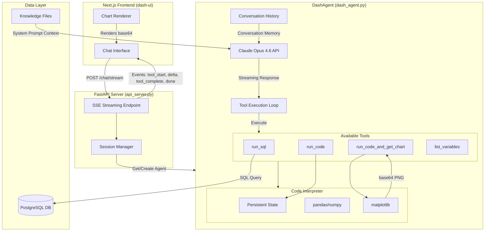
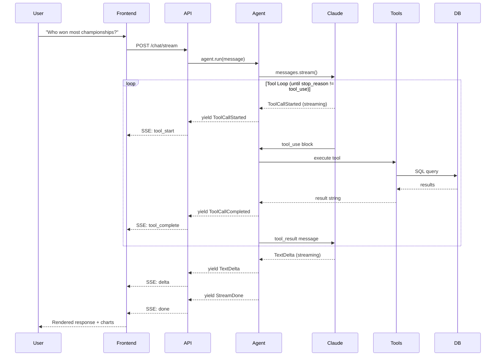

# CLAUDE.md

This file provides guidance to Claude Code (claude.ai/code) when working with code in this repository.

## Project Overview

Dash is a data agent that delivers **insights, not just SQL results**. Uses pure Anthropic SDK (no framework dependencies).

## Architecture Diagram



## Data Flow



## Structure

```
dash/
├── dash_agent.py         # Pure Anthropic SDK agent (MAIN AGENT)
├── agents.py             # Legacy Agno-based agent (deprecated)
├── paths.py              # Path constants
├── knowledge/            # Knowledge files (tables, queries, business rules)
│   ├── tables/           # Table metadata JSON files
│   ├── queries/          # Validated SQL queries
│   └── business/         # Business rules and metrics
└── tools/
    └── code_interpreter.py # Legacy (now built into dash_agent.py)

api_server.py             # FastAPI server with SSE streaming
../dash-ui/               # Next.js frontend (separate directory)

db/
├── session.py            # PostgreSQL session factory
└── url.py                # Database URL builder
```

## Commands

```bash
# Setup
source .venv/bin/activate

# Run API Server
python api_server.py

# Run Frontend (separate terminal)
cd ../dash-ui && npm run dev
```

## Architecture (Pure Anthropic SDK)

```python
from dash.dash_agent import DashAgent
from db.url import db_url

agent = DashAgent(db_url=db_url)

# Streaming chat
for chunk in agent.chat("What tables are available?"):
    print(chunk, end="")

# Or sync
response = agent.chat_sync("How many drivers won championships?")
```

**Tools available to the agent:**
- `run_sql` - Execute SQL queries against PostgreSQL
- `run_code` - Execute Python code (persistent state like Jupyter)
- `run_code_and_get_chart` - Create matplotlib charts (agent controls styling)
- `list_variables` - Show variables in Python session

## Code Interpreter

Built into `dash_agent.py` with:
- **Persistent state**: Variables persist across tool calls
- **Pre-loaded**: pandas as `pd`, numpy as `np`, `run_sql(query)` function
- **Charts**: Returned as base64 with markers `[CHART_BASE64]...[/CHART_BASE64]`

## API Server

**Endpoints:**
- `GET /` - Health check
- `POST /chat` - Non-streaming chat
- `POST /chat/stream` - SSE streaming
- `POST /clear` - Clear session history

**Chart Handling:**
- Charts marked with `[CHART_BASE64]...[/CHART_BASE64]`
- Frontend extracts base64 and renders inline

## Environment Variables

| Variable | Required | Description |
|----------|----------|-------------|
| `ANTHROPIC_API_KEY` | Yes | Anthropic API key (for Claude) |
| `DB_*` | No | Database config (defaults to localhost) |
