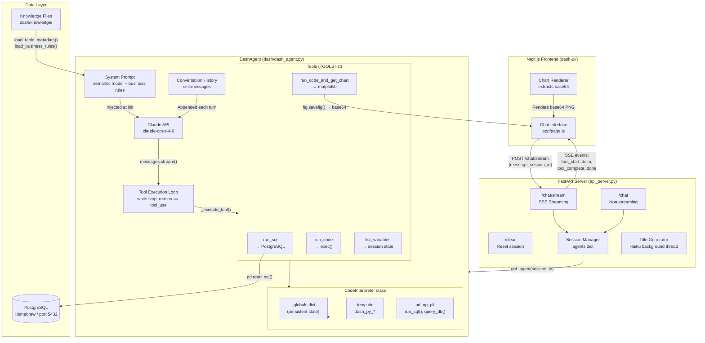
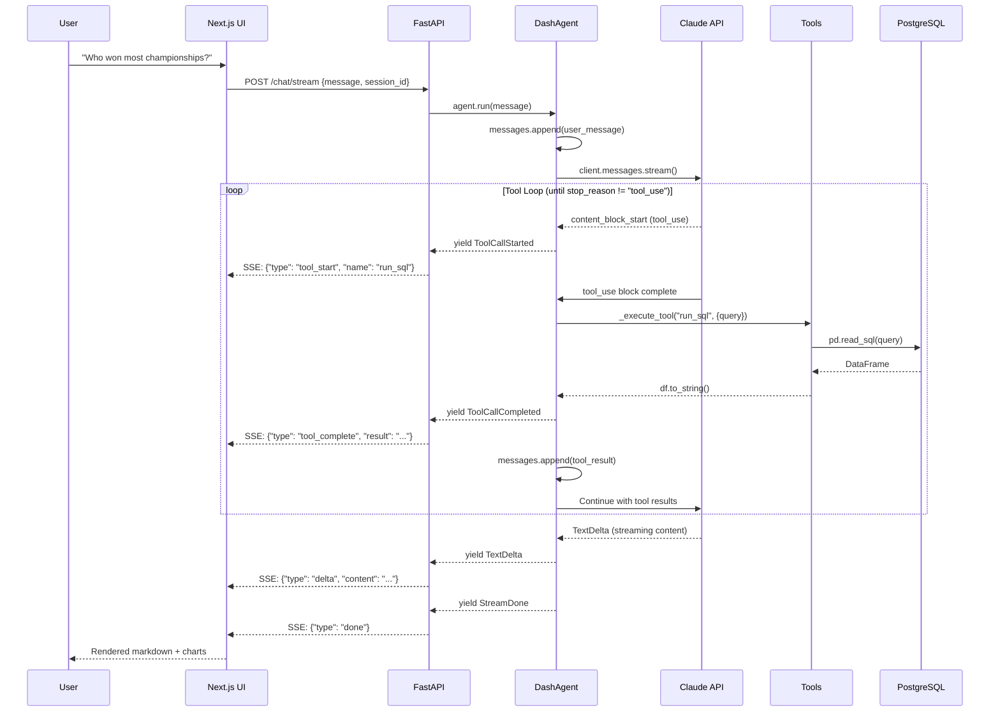

# CLAUDE.md

This file provides guidance to Claude Code (claude.ai/code) when working with code in this repository.

## Project Overview

Dash is a data agent that delivers **insights, not just SQL results**. Built with pure Anthropic SDK — no framework dependencies.

## System Architecture



## Data Flow (Streaming)



## Directory Structure

```
dash-repo/
├── api_server.py                 # FastAPI server — MAIN ENTRY POINT
│                                 # SSE streaming, conversations CRUD, session mgmt, Haiku titles
├── dash/
│   ├── __init__.py               # Exports: DashAgent, create_agent
│   ├── __main__.py               # CLI: python -m dash
│   ├── dash_agent.py             # Core agent — DashAgent, CodeInterpreter, TOOLS, events, system prompt
│   ├── r_interpreter.py          # R code execution (RInterpreter class)
│   ├── paths.py                  # Path constants (KNOWLEDGE_DIR, etc.)
│   ├── context/                  # System prompt builders
│   │   ├── semantic_model.py     # load_table_metadata()
│   │   └── business_rules.py     # load_business_rules()
│   ├── knowledge/                # Static knowledge (JSON/SQL files)
│   │   ├── tables/*.json         # Table schemas — {table_name, description, columns, gotchas}
│   │   ├── business/metrics.json # Metrics, business rules, common gotchas
│   │   └── queries/common_queries.sql
│   └── scripts/
│       └── load_data.py          # Downloads F1 CSVs → PostgreSQL
├── db/
│   ├── __init__.py               # Exports: db_url
│   └── url.py                    # Builds PostgreSQL connection URL from env vars
├── scripts/
│   └── retitle_conversations.py  # One-off: re-title conversations with Haiku
├── compose.yaml                  # Docker (legacy, not used — Homebrew Postgres now)
├── pyproject.toml                # Python project config
└── requirements.txt              # Dependencies
```

## Key Components

### DashAgent (dash/dash_agent.py)

The agent uses a "think first" system prompt — it breaks down problems from first principles, states assumptions, and asks the user before executing. Insights go in the text response, not in tool call print() output.

```python
class DashAgent:
    def __init__(self, db_url: str, model: str = "claude-opus-4-6"):
        self.client = anthropic.Anthropic()
        self.interpreter = CodeInterpreter(db_url)  # Persistent Python state
        self.r_interpreter = RInterpreter(db_url)   # Persistent R state
        self.messages = []  # Conversation history

    def run(self, message: str) -> Generator[Event]:
        # Yields: ToolCallStarted, ToolCallCompleted, TextDelta, StreamDone

    def restore_history(self, frontend_messages: list):
        # Converts frontend event format to Claude message format
```

### Tools

| Tool | Purpose | Returns |
|------|---------|---------|
| `run_sql` | Execute PostgreSQL query | DataFrame as string |
| `run_code` | Execute Python (persistent state) | stdout or result |
| `run_code_and_get_chart` | Create matplotlib chart | `[CHART_BASE64]...[/CHART_BASE64]` |
| `list_variables` | Show session variables | Variable names + types |
| `create_d3_chart` | Interactive D3.js chart | `[D3_CHART]...[/D3_CHART]` |
| `run_r_code` | Execute R code (persistent state) | stdout or result |
| `run_r_chart` | Create ggplot2 chart | `[CHART_BASE64]...[/CHART_BASE64]` |
| `list_r_variables` | Show R session variables | Variable names + types |

### CodeInterpreter

- **Persistent state**: `_globals` dict survives across tool calls (like Jupyter)
- **Pre-loaded**: `pd`, `np`, `plt`, `run_sql()`, `query_db()`
- **Temp directory**: All code executes in `dash_py_*` temp dir — generated files (charts, CSVs) don't clutter the repo
- **Charts**: Saved to base64 PNG with markers for frontend extraction

### R Interpreter (dash/r_interpreter.py)

- **Persistent state**: R environment survives across tool calls via `.RData` files
- **Preamble script**: Sourced every call to reload packages (save.image doesn't persist loaded namespaces)
- **Pre-loaded**: `dplyr`, `ggplot2`, `tidyr`, `query_db()`, `run_sql()`
- **Temp directory**: All R code runs in `dash_r_*` temp dir
- **Requires**: R and Rscript installed on system

### Session Management (api_server.py)

- Each conversation gets its own `session_id` (= conversation UUID) → own `DashAgent` instance
- Per-session lock prevents concurrent requests from corrupting agent state
- Sessions expire after 30 minutes of inactivity (auto-cleanup)
- `/restore` endpoint rebuilds agent history when loading an old conversation

### Auto-Generated Titles

- After the first user message, a background thread calls `claude-haiku-4-5-20251001` to generate a 3-6 word title
- Non-blocking — doesn't slow down the chat response
- Falls back to truncating the first message if Haiku fails

## Commands

```bash
# Start PostgreSQL (Homebrew)
brew services start postgresql@16

# Load F1 data (first time only)
.venv/bin/python -m dash.scripts.load_data

# Run API server (port 8000)
.venv/bin/python api_server.py

# Run frontend (port 3000, separate terminal)
cd ../dash-ui && npm run dev

# CLI mode (interactive)
.venv/bin/python -m dash

# Re-title all conversations with Haiku (one-off)
.venv/bin/python scripts/retitle_conversations.py
```

**Important**: Always use `.venv/bin/python` — system Python is 3.9 and doesn't support modern syntax. The venv has Python 3.13.

## API Endpoints

| Endpoint | Method | Body | Response |
|----------|--------|------|----------|
| `/` | GET | - | `{"status": "ok", "model": "..."}` |
| `/chat` | POST | `{message, session_id?, language?}` | `{response, tool_calls, charts}` |
| `/chat/stream` | POST | `{message, session_id?, language?}` | SSE stream |
| `/clear` | POST | `{session_id?}` | `{"status": "cleared"}` |
| `/restore` | POST | `{session_id, messages}` | `{"status": "restored"}` |
| `/conversations` | GET | - | `{conversations: [...]}` |
| `/conversations` | POST | `{title?, language?}` | `{id, status}` |
| `/conversations/{id}` | GET | - | `{id, title, messages, language, ...}` |
| `/conversations/{id}` | PUT | `{title?, messages?}` | `{status, id}` |
| `/conversations/{id}` | DELETE | - | `{status, id}` |
| `/conversations/{id}/messages` | POST | `{messages}` | `{status, id}` — triggers Haiku title on first message |

### SSE Event Types

```json
{"type": "tool_start", "name": "run_sql", "args": {...}}
{"type": "tool_complete", "name": "run_sql", "result": "..."}
{"type": "delta", "content": "Hamilton won..."}
{"type": "done"}
{"type": "error", "error": "..."}
```

## Environment Variables

| Variable | Required | Description |
|----------|----------|-------------|
| `ANTHROPIC_API_KEY` | Yes | Claude API key |
| `DB_HOST` | No | PostgreSQL host (default: localhost) |
| `DB_PORT` | No | PostgreSQL port (default: 5432) |
| `DB_USER` | No | PostgreSQL user (default: ai) |
| `DB_PASS` | No | PostgreSQL password (default: ai) |
| `DB_DATABASE` | No | Database name (default: ai) |

## Database

PostgreSQL 16 via Homebrew (`brew services start postgresql@16`). Tables live in the `ai` schema with `search_path` set to `ai, public`.

### F1 Dataset Tables

| Table | Rows | Key Columns | Gotchas |
|-------|------|-------------|---------|
| `drivers_championship` | ~1575 | year, position, name, team, points | position is TEXT ('1', '2', 'Ret') |
| `constructors_championship` | ~655 | year, position, team, points | position is INTEGER (different!) |
| `race_results` | ~23155 | year, position, name, team, venue | position is TEXT |
| `race_wins` | ~1038 | date, name, team, venue | date is TEXT ('DD Mon YYYY') |
| `fastest_laps` | ~1035 | year, name, team, venue, time | - |

### Conversation Storage

| Table | Columns |
|-------|---------|
| `conversations` | id (UUID), title, messages (JSONB), language, created_at, updated_at |

Title is auto-generated by Haiku after the first user message.
